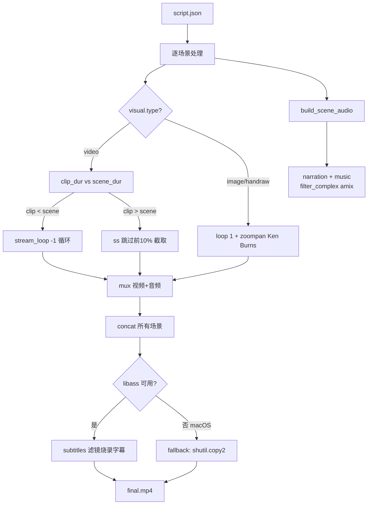

# FFmpeg 视频合成：循环/截取/zoompan/字幕/音频混合

## 概述

compose-video skill 使用 FFmpeg 将多个场景（视频/图片/手绘图 + TTS 音频 + 背景音乐）合成为最终 MP4。核心挑战是处理素材时长与场景时长不匹配、多轨音频混合、字幕烧录，以及 macOS 上 libass 缺失的 fallback。

## 工作原理

### 合成流程



### 关键 FFmpeg 命令模式

**视频循环（素材短于场景）**:
```bash
ffmpeg -stream_loop -1 -i input.mp4 -t {scene_dur} -c:v libx264 output.mp4
```

**视频截取（素材长于场景，跳过前10%）**:
```bash
ffmpeg -ss {clip_dur * 0.1} -i input.mp4 -t {scene_dur} -c:v libx264 output.mp4
```

**图片/手绘图转视频（zoompan Ken Burns 效果）**:
```bash
ffmpeg -loop 1 -i input.png -t {scene_dur} \
  -vf "scale=1280:720,zoompan=z='min(zoom+0.001,1.1)':d={dur*25}:s=1280x720" \
  -c:v libx264 output.mp4
```

**手绘图 fade-in 效果**:
```bash
-vf "scale=1280:720,fade=in:0:30,zoompan=..."
```

**音频混合（narration + music）**:
```bash
ffmpeg -i narration.mp3 -i music.mp3 \
  -filter_complex "[1:a]volume={music_vol}[bg];[0:a][bg]amix=inputs=2:duration=first[out]" \
  -map "[out]" mixed.mp3
```

**字幕烧录（需要 libass）**:
```bash
ffmpeg -i video.mp4 -vf "subtitles=subs.srt" output_with_subs.mp4
```

**macOS libass 缺失 fallback**:
```python
try:
    # 尝试 subtitles 滤镜
    subprocess.run([...subtitles=subs.srt...], check=True)
except subprocess.CalledProcessError:
    # fallback: 直接复制，无字幕
    shutil.copy2(raw_output, output_path)
```

### SRT 字幕格式生成

```python
def generate_srt(scenes, output_path):
    lines = []
    t = 0
    for i, scene in enumerate(scenes):
        start = format_time(t)
        end = format_time(t + scene['duration'])
        lines.append(f"{i+1}\n{start} --> {end}\n{scene.get('subtitle', '')}\n")
        t += scene['duration']
    Path(output_path).write_text('\n'.join(lines))

def format_time(seconds):
    h = int(seconds // 3600)
    m = int((seconds % 3600) // 60)
    s = int(seconds % 60)
    ms = int((seconds - int(seconds)) * 1000)
    return f"{h:02d}:{m:02d}:{s:02d},{ms:03d}"
```

## 如何控制/使用

1. **分辨率预设**: `--resolution 720p|1080p|4K|1280x720`
2. **背景音乐音量**: `--music-volume 0.3`（0.0-1.0）
3. **帧率**: `--fps 25`
4. **输出格式**: `--format mp4|mov|webm`
5. **非交互模式**: `--no-interactive`（跳过确认提示）

```bash
python3 compose.py \
  --script workspace/my_video/.../script.json \
  --resolution 1080p \
  --fps 25 \
  --music-volume 0.2 \
  --no-interactive
```

## 示例

macOS 上安装 libass 以支持字幕：
```bash
brew install ffmpeg --with-libass
# 或者用 Homebrew 的完整版本
brew install ffmpeg
# 验证
ffmpeg -filters | grep subtitles
```

如果 libass 不可用，compose.py 会自动 fallback 到无字幕版本，视频正常生成，仅缺少字幕烧录。
