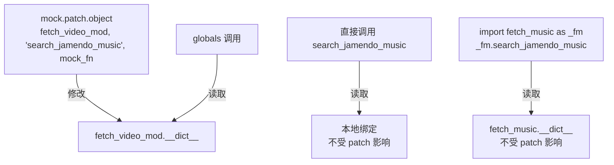

# Provider 抽象层模式：Python Protocol + mock 测试技巧

## 概述

cut 技能包中所有 AI 服务（TTS、图像生成、视频生成、手绘图）均采用依赖倒置设计：用 Python `Protocol` 定义接口，通过 `cut-config.yaml` 配置选择实现，测试时通过 `provider_map` 注入 mock 实现。

## 工作原理

### Protocol 接口定义

```python
# tts_base.py
from typing import Protocol, runtime_checkable

@runtime_checkable
class TTSProvider(Protocol):
    def synthesize(self, text: str, output_path: str, voice: str = None) -> None:
        ...
```

关键点：
- `@runtime_checkable` 允许 `isinstance(obj, TTSProvider)` 运行时检查
- 用 Protocol 而非 ABC：无需继承，duck typing，mock 注入更简洁

### provider_map 动态加载

```python
# gen_handraw.py
PROVIDER_MAP = {
    "chart_svg": "providers.handraw_chart_svg:HandrawChartSVGProvider",
    "illus_dalle": "providers.handraw_illus_dalle:HandrawIllusDalleProvider",
}

def get_provider(name: str):
    module_path, class_name = PROVIDER_MAP[name].rsplit(":", 1)
    module = importlib.import_module(module_path)
    return getattr(module, class_name)()
```

### globals() 与 mock.patch.object 的关键关系



**结论**：在被 patch 的模块内，必须用 `globals()[fn_name](...)` 而非直接调用或跨模块委托，才能让 mock 生效。

```python
# ✅ 正确：globals() 与 mock.patch.object 操作同一个 dict
def fetch_video_candidates(query, **kwargs):
    for fn_name in ['search_pexels_videos', 'search_pixabay_videos']:
        results = globals()[fn_name](query, **kwargs)
        if results:
            return results
    return []

# ❌ 错误：import 委托，mock 不生效
def fetch_music_candidates(query, **kwargs):
    import fetch_music as _fm
    return _fm.search_jamendo_music(query, **kwargs)  # mock 打不到这里
```

### provider 注入测试模式

```python
# 测试代码
class MockHandrawProvider:
    def generate(self, subject, output_path):
        Path(output_path).write_bytes(b"fake_png_data")
        return output_path

# gen_handraw.generate() 支持直接传入 provider 实例
generate(subject="test", output_path="/tmp/out.png", provider=MockHandrawProvider())
```

## 如何控制/使用

1. **切换服务商**: 编辑 `cut-config.yaml` 中对应的 `provider` 字段
2. **添加新 provider**: 实现 Protocol 接口，在 `provider_map` 中注册 `"module:Class"` 字符串，无需修改主逻辑
3. **测试注入**: 直接传入 mock provider 实例，或用 `mock.patch.object` patch 模块级函数

```yaml
# cut-config.yaml
tts:
  provider: edge_tts  # 改为 openai 或 elevenlabs

image_generation:
  provider: dalle3    # 改为 stable_diffusion
```

## 示例

添加新的 TTS provider（Azure TTS）：

```python
# providers/tts_azure.py
class AzureTTSProvider:
    def synthesize(self, text: str, output_path: str, voice: str = None) -> None:
        # Azure TTS 实现
        ...
```

在 `gen_tts.py` 的 provider_map 中注册：

```python
PROVIDER_MAP = {
    "edge_tts": EdgeTTSProvider,
    "openai": OpenAITTSProvider,
    "azure": AzureTTSProvider,  # 新增
}
```

`cut-config.yaml` 中切换：`provider: azure`，无需其他改动。
