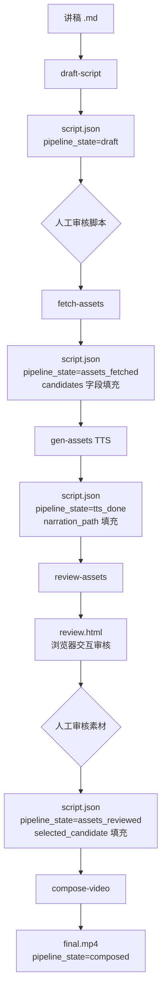

# cut 流水线架构与 pipeline_state 状态机

## 概述

cut 是一个将文字讲稿转化为视频的 AI 流水线，由 5 个 sub-skill 串联组成。核心数据结构是 `script.json`，通过 `pipeline_state` 字段记录流水线当前阶段，各 skill 读取并更新这个文件，实现状态传递。

## 工作原理

### 整体流水线



### pipeline_state 状态机

| 状态 | 由谁设置 | 含义 |
|------|---------|------|
| `draft` | draft-script | 脚本已生成，待人工审核 |
| `script_reviewed` | 人工 | 脚本已确认，可进入素材阶段 |
| `assets_fetched` | fetch-assets | 候选素材已搜索，待审核 |
| `tts_done` | gen-audio-tts | TTS 旁白已生成 |
| `assets_reviewed` | review-assets (JS) | 素材已选定，可合成 |
| `composed` | compose-video | 视频已合成 |

### script.json 核心结构

```json
{
  "title": "视频标题",
  "total_duration": 300,
  "pipeline_state": "draft",
  "scenes": [
    {
      "id": "scene_01",
      "duration": 10,
      "narration": "旁白文字",
      "subtitle": "字幕文字",
      "visual": {
        "type": "video|image|handraw_chart|handraw_illustration",
        "keywords": ["english", "keywords"],
        "status": "pending|candidates_ready|approved|generating|ready",
        "selected_candidate": null,
        "candidates": [],
        "asset_path": null
      },
      "audio": {
        "narration_status": "pending|ready",
        "narration_path": null,
        "music": {
          "keywords": ["mood:calm"],
          "volume": 0.3,
          "asset_path": null
        }
      }
    }
  ]
}
```

### visual.type 四种类型

| type | 来源 | 生成方式 |
|------|------|---------|
| `video` | fetch-assets (Pexels/Pixabay) | 搜索库存视频 |
| `image` | fetch-assets (Pexels/Pixabay) | 搜索库存图片 |
| `handraw_chart` | gen-assets | SVG 模板 → cairosvg → PNG |
| `handraw_illustration` | gen-assets | DALL-E 3（手绘风格 prompt）|

## 如何控制/使用

1. **选择入口**: 每个 skill 都有独立的 CLI 脚本，可单独运行某一阶段
2. **状态检查**: 读取 `script.json` 的 `pipeline_state` 判断当前阶段
3. **断点续跑**: 各 skill 读取现有 script.json 状态，已完成的场景可跳过
4. **配置服务商**: 编辑 `cut-config.yaml` 切换 TTS / 图像 / 视频生成服务商

```bash
# 完整流水线示例
python3 cut/skills/draft-script/scripts/draft_script.py --input my_lecture.md --project my_video
python3 cut/skills/fetch-assets/scripts/fetch_assets.py --script workspace/my_video/.../script.json
python3 cut/skills/gen-assets/scripts/gen_tts.py --script workspace/my_video/.../script.json
python3 cut/skills/review-assets/scripts/generate_review.py --script workspace/my_video/.../script.json
python3 cut/skills/compose-video/scripts/compose.py --script workspace/my_video/.../script.json
```

## 示例

《程序员消亡史》端到端验证结果：
- 输入：3447 字讲稿
- 脚本：11 个场景，总时长 128s
- 素材：edge-tts TTS + 占位图片/视频
- 输出：`final.mp4`，99.2s，1280x720，含音频轨
